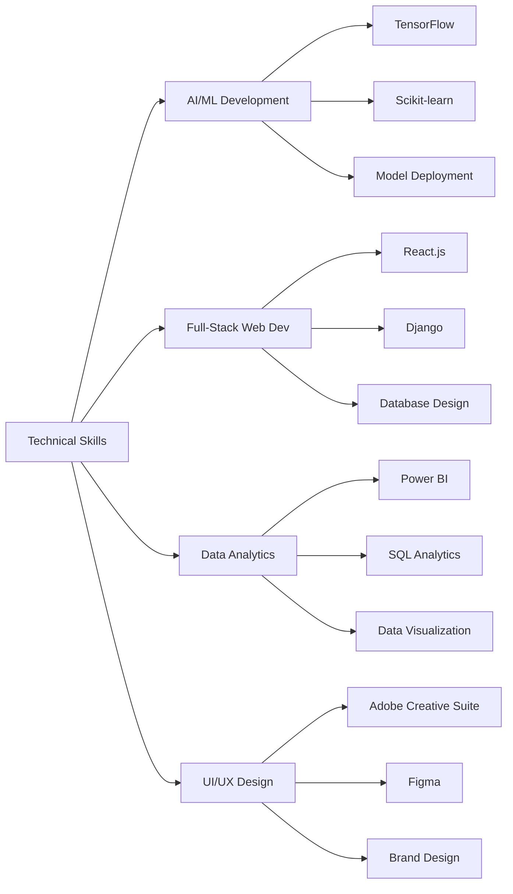

# Hi there 👋, I'm Abhishek Sharma

<div align="center">
  
</div>

<div align="center">
  
[](https://www.linkedin.com/in/abhishek-sharma-080b2530b/)
[](https://github.com/Pixelated-Sage)
[](mailto:pixelatedsage@gmail.com)

</div>

---

## 🚀 About Me

```typescript
const abhishek = {
    role: "Computer Science Student & Developer",
    location: "India 🇮🇳",
    education: "B.Tech Computer Science Engineering",
    focus: ["AI/ML", "Full-Stack Development", "Data Analytics"],
    currentlyLearning: ["TensorFlow", "Advanced React", "System Design"],
    funFact: "I turn coffee into code ☕ → 💻"
};
```

I'm a passionate Computer Science student specializing in **AI/ML** and **Full-Stack Development**. I love creating innovative solutions that bridge the gap between cutting-edge technology and real-world applications. My journey involves continuous learning, building impactful projects, and contributing to the tech community.

---

## 🛠️ Tech Stack

<div align="center">

### Languages


### Frontend


### Backend & Databases


### AI/ML & Data Science


### Tools & Platforms


</div>

---

## 📈 GitHub Analytics

<div align="center">
  
  
</div>

<div align="center">
  
</div>

<div align="center">
  
</div>

---

## 🎯 Featured Projects

<div align="center">

[](https://github.com/Pixelated-Sage/Django-Backend)
[](https://github.com/Pixelated-Sage/python-DSA)

[](https://github.com/Pixelated-Sage/ML-Learning)

</div>

### 🔥 Project Highlights

<table>
<tr>
<td width="50%">

**🍽️ Django Restaurant Management**
- Full-stack web application with Django
- User authentication & order processing
- MySQL database integration
- Responsive Bootstrap 5 design

*Tech: Django, Python, MySQL, Bootstrap*

</td>
<td width="50%">

**🧠 Machine Learning Journey**
- Comprehensive ML algorithm implementations
- Hands-on projects with real datasets
- From fundamentals to advanced concepts
- Jupyter notebooks for learning

*Tech: Python, Scikit-learn, TensorFlow, Pandas*

</td>
</tr>
<tr>
<td width="50%">

**💻 Data Structures & Algorithms**
- Problem-solving skill enhancement
- Core CS concepts implementation
- Optimized Python solutions
- Interview preparation focused

*Tech: Python, Algorithms, Data Structures*

</td>
<td width="50%">

**📊 Data Analytics Projects**
- Business intelligence dashboards
- Data visualization and insights
- Interactive Power BI reports
- Excel automation solutions

*Tech: Power BI, Excel, SQL, Python*

</td>
</tr>
</table>

---

## 🎓 Education & Certifications

<div align="center">

### 🏫 Education
**B.Tech Computer Science Engineering**  
*Swami Vivekananda Institute of Engineering and Technology* | 2023 - Present

**Class 12 (Non-Medical)**  
*SGJ. DAV. SEN. SEC. PUBLIC SCHOOL, HARIPURA* | 2022 - 2023

</div>

### 🏆 Certifications

<div align="center">

| Platform | Certification | Status |
|----------|--------------|--------|
| 🐍 **HackerRank** | Python Basics | ✅ Certified |
| 📊 **Kaggle** | Pandas | ✅ Certified |
| 🌟 **Geekster** | Git & GitHub | ✅ Certified |
| 📈 **OfficeMaster** | Power BI | ✅ Certified |
| 🤖 **Infosys** | Fundamentals of AI/ML | ✅ Certified |
| 🧠 **Infosys** | Introduction to Machine Learning | ✅ Certified |

</div>

---

## 💼 Professional Skills

<div align="center">



</div>

**🎨 Design Portfolio Highlights:**
- 70+ promotional graphics and event posters designed
- Brand consistency maintenance across platforms
- Social media content creation and management
- UI/UX design for web applications

---

## 📊 Weekly Development Breakdown

<!--START_SECTION:waka-->
```text
Python       8 hrs 45 mins   ████████████░░░░░░░░░░░░░   48.2%
JavaScript   4 hrs 12 mins   ██████░░░░░░░░░░░░░░░░░░░   23.1%
SQL          2 hrs 30 mins   ███░░░░░░░░░░░░░░░░░░░░░░   13.8%
HTML/CSS     1 hr 45 mins    ██░░░░░░░░░░░░░░░░░░░░░░░    9.7%
Other        58 mins         █░░░░░░░░░░░░░░░░░░░░░░░░    5.2%
```
<!--END_SECTION:waka-->

---

## 🌟 What Drives Me

<div align="center">

*"Innovation distinguishes between a leader and a follower."* - Steve Jobs

</div>

I believe in the power of technology to solve real-world problems. My passion lies in:

- 🚀 **Building scalable solutions** that make a difference
- 🧠 **Continuous learning** and staying updated with tech trends  
- 🤝 **Collaborating** with fellow developers and designers
- 📈 **Data-driven decision making** for better outcomes
- 🎨 **Creating intuitive user experiences** through thoughtful design

---

## 📫 Let's Connect!

<div align="center">

I'm always excited to collaborate on interesting projects or discuss new opportunities!

[](https://www.linkedin.com/in/abhishek-sharma-080b2530b/)
[](mailto:pixelatedsage@gmail.com)
[](https://github.com/Pixelated-Sage)
[](https://wa.me/917508317625)

</div>

---

<div align="center">
  
</div>

<div align="center">
  
**⚡ "Turning Ideas Into Innovation" ⚡**

*Thanks for visiting my profile! Feel free to explore my repositories and don't hesitate to reach out.* 🚀

</div>

---

<div align="center">
  
</div>
